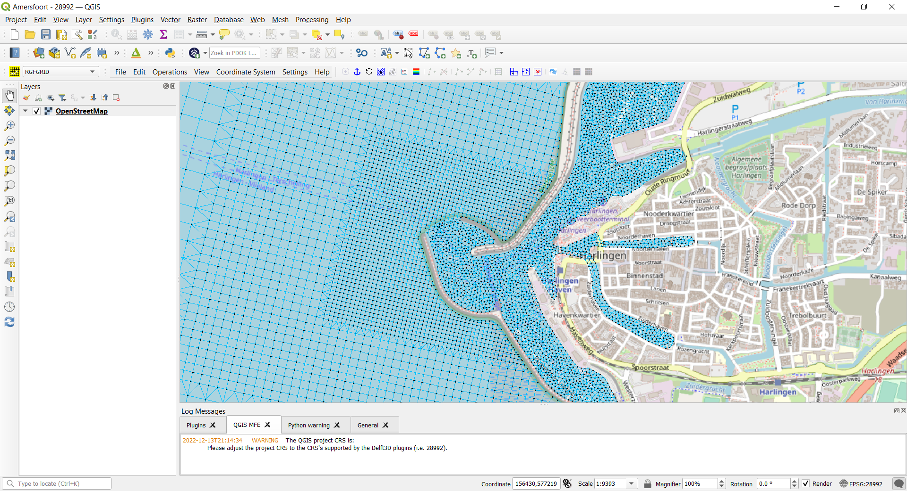

# QGIS MFE
QGIS plugin to support the Delft3D 4 plugins RGFGRID, QUICKIN, RemoteOLV and DIDO.
To run these plugins the Delft3D 4.05.01 Suite or later should be installed on your system.

Remark: although Delft3D 4 is only suitable for structured grids, the RGFGRID plugins is suitable for unstructured grids (UGRID 2D compliant).

## To build
To build the plugin qgis_umesh you have to install QGIS (OSGeo4W network installer (64 bit), https://qgis.org/en/site/forusers/download.html ), QT 5.15 LTS, BOOST 1.78.0 and netCDF4.
The windows solution will place the qgis_umesh.dll on the qgis plugin directory (ex. c:\OSGeo4W64\apps\qgis\plugins\qgis_umesh.dll)

Be aware that the qt515\*.lib files should be the same as used for building the plugins rgfgri.dll and dido.dll as available in the Delft3D 4 installation

## Development environment
At this moment the development environment is based on Visual Studio 2019.
 
## Environment variables
Environment variables (example)
QT5DIR64=c:\Qt\Qt5.15.2\5.15.2\msvc2019_64\
QT5DIR64OSGEO=c:\OSGeo4W64\apps\Qt5

## Link Libraries    
qgis library:
debug and release folder contain the same libraries
./lib/x64/release/qgis_analysis.lib
                 /qgis_core.lib
                 /qgis_gui.lib
./lib/x64/debug/qgis_analysis.lib
               /qgis_core.lib
               /qgis_gui.lib

## Installing QGIS from OSGeo4W
Installing QGIS from OSGeo4W network installer (64 bit)
After a few screens.
Selectpackages to install.
Desktop:
    qgis: QGIS Desktop
    qgis-full: QGIS Full Desktop (meta package for express install)
Libs: 
    QGIS-devel: QGIS development files
    QT5-libs: Qt5 runtime libraries
    qt5-libs-debug
    qt5-libs-debug-pdb
    qt5-libs-pdb
    qt5-devel; qt5 headers and libraries (Development)
Probably not needed
    qt5-qml: Qt5 QML
    qt5-tools: Qt5Designe & linguist (Development)
            
##Note (QGIS 3.18.01 and higher)
When compiling the source code I had to adjusted the file qgsdistancearea.h.
An extra define of M_PI_2 is added at line 215
#ifndef M_PI_2
#define M_PI_2 1.57079632679489661923
#endif

and file qgsabstractgeometry.h
Line 574
#ifndef M_PI
#define M_PI 3.14159265358979323846264338327950288
#endif

and also file qgsvector.h:
Line 172
#ifndef M_PI
#define M_PI 3.14159265358979323846264338327950288
#endif

## Note (QGIS 3.16.03)
When compiling the source code I had to adjusted the file
c:\OSGeo4W64\apps\qgis\include\qgsabstractgeometry.h
An extra define of M_PI is added.

Line 543
#ifndef M_PI
#define M_PI 3.14159265358979323846264338327950288
#endif

and also file qgsvector.h:
Line 172
#ifndef M_PI
#define M_PI 3.14159265358979323846264338327950288
#endif

## Note (QGIS 3.16.00)
When QGIS 3.16.00 does close/crash without any message if reading a netCDF file, please use QGIS 3.16.01.
 
end document
